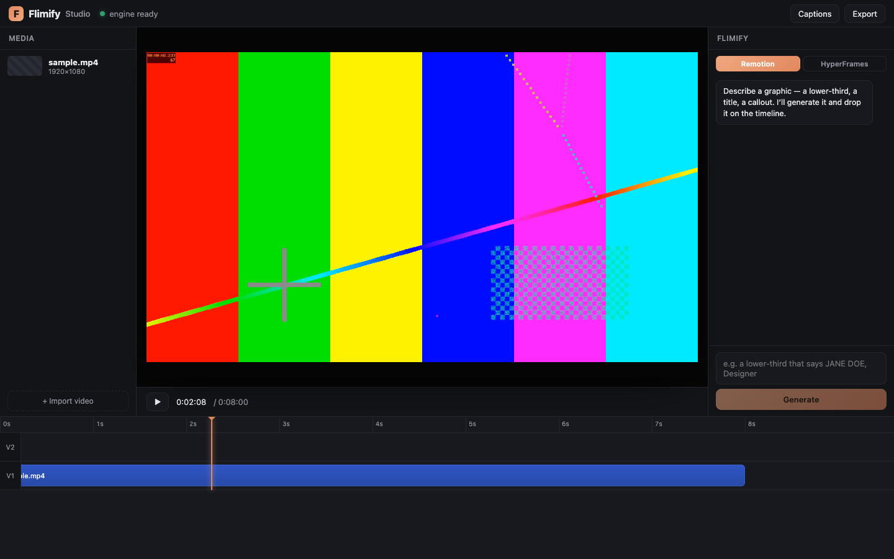

# Flimify Studio

An **AI-native video editor** — generate motion graphics, drop them on a
timeline, edit, caption, and export to mp4. A standalone desktop app (**Mac &
Windows**) that also runs in the **browser**. Its killer feature: **AI generation
runs on your own Claude subscription — no API key, no per-render cost.**

> A full pro-style NLE (timeline, snapping, undo/redo, split, fades, markers,
> track mute/solo/lock, captions, auto-edit) with an AI copilot built in — like
> Submagic / Opus / Captions, but the AI is free because it runs locally on your
> Claude.



## What works today

- **Import footage** → media bin → timeline (V1), served to the live preview
  with HTTP range streaming.
- **Live preview** — `@remotion/player` composites the whole timeline in real
  time. The timeline *is* a Remotion composition, so **preview == export**.
- **Generate AI overlays** — describe a lower-third / title / callout → the
  local Claude CLI builds a Remotion or HyperFrames graphic → alpha overlay
  drops onto V2. No API key.
- **Auto-Captions** — one click transcribes the footage (parakeet-mlx, local)
  and renders an animated TikTok-style caption track onto V2. No API key.
- **Timeline editing** — select, drag to move, edge-drag to trim, Delete to
  remove. Space toggles play.
- **Export** → renders the timeline to an mp4 via Remotion.
- **Desktop app** — Electron window that auto-launches the local backend; native
  menu (⌘I import, ⌘E export), app icon, About.

## Architecture

```
Flimify Studio
├── renderer (Vite + React + @remotion/player)   src/        ← the editor UI
│   ├── editor/      timeline model + composition + interactive strip
│   ├── panels/      the Flimify AI chat panel
│   └── api.ts       client for the local backend
├── electron/        desktop shell — window, menu, spawns the backend
├── studio-bridge/   local Node backend (server.cjs):
│   ├── /import      ffprobe a video → clip metadata
│   ├── /generate    spawn the local `claude` CLI → Remotion/HyperFrames
│   │                render → alpha overlay clip   (NO API KEY)
│   ├── /export      timeline state → Remotion render → mp4
│   └── /media       serve imported + generated media (range requests)
└── render/_studio/  the Remotion export composition (deployed to the render project)
```

The same composition model previews in the Player **and** renders on export —
no preview/export split.

## Run (dev)

```bash
npm install
npm run app        # Vite + Electron together → the desktop window
# or:
npm run dev        # just the editor in a browser (http://localhost:5191)
node studio-bridge/server.cjs   # the backend (browser-dev needs it running)
```

## Build a desktop installer

```bash
npm run build:app  # vite build + electron-builder → release/  (.dmg on Mac, .exe on Win)
```

## Configuration

The backend reads a few env vars (sensible defaults):

| Var | Default | Purpose |
|---|---|---|
| `FLIMIFY_STUDIO_PORT` | `3939` | backend port |
| `FLIMIFY_RENDER_PROJECT` | `~/PremiereClaude/remotion-intro` | the Remotion project renders run in |
| `FLIMIFY_CLAUDE` | `~/.local/bin/claude` | the Claude CLI binary |
| `FLIMIFY_STUDIO_DIR` | `~/FlimifyStudio` | media + renders store |

## Known limitations / next

- **Render project**: generation/export currently reuse the existing
  `remotion-intro` Remotion install (full toolkit + HyperFrames). Bundling a
  self-contained render project into the app is the next packaging step so it
  runs with zero external setup.
- **Auto-Edit graphic-placement**: captions are ported; the remaining piece is
  placing *graphics* at detected speech moments (reuses /generate per moment).
- **Web mode**: same editor UI, but generation runs server-side (no local CLI
  on the web) — a metered paid tier, after the desktop app.

Built with [Remotion](https://remotion.dev) · [HyperFrames](https://github.com/heygen-com/hyperframes) · Electron.
